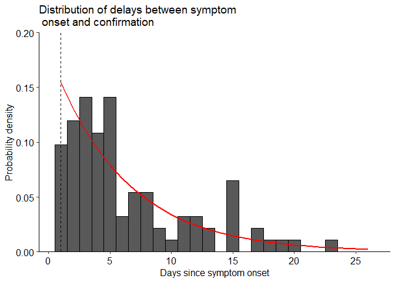
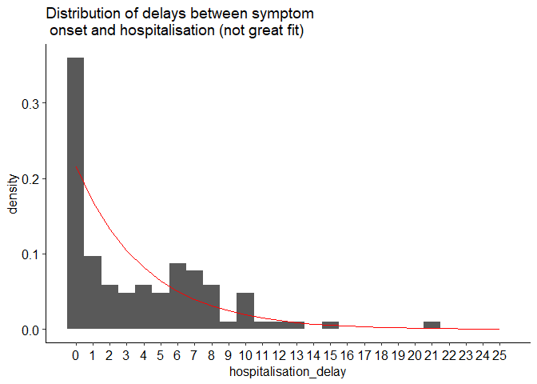
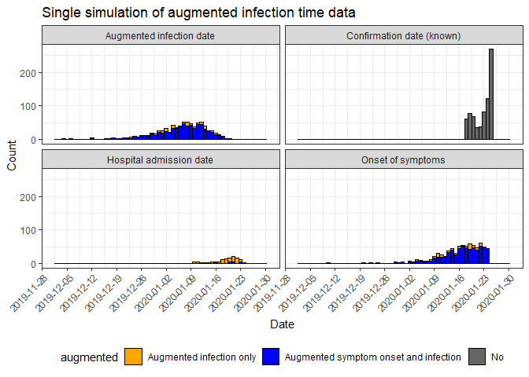

Turning nCoV case reports into infection incidence
================
James Hay <jhay@hsph.harvard.edu>

``` r
source("code/analysis.R")
```

    ## [1] "Number of given confirmation dates (ie. max we can augment): 784"

``` r
knitr::opts_chunk$set(echo = TRUE)
```

## Introduction

Available line list data for 2019-nCoV mostly show the date of report
and not the date of infection onset. These reported cases therefore do
not directly represent underlying transmission dynamics, but rather the
day at which sick individuals become known to the healthcare system
(plus some delay in reporting). To understand the dynamics of the
outbreak, it is more informative to use the incidence curve for
infections rather than case reports. Here, I try to generate realistic
infection and symptom onset incidence curves that makes use of the
confirmed case data from Hubei and elsewhere in China. I use a
bootstrapping technique to propagate uncertainty through the
predictions.

This does *not* provide any new data nor does it provide any sort of
forward projections. This is simply to generate a range of plausible
infection and symptom onset curves that could have given rise to the
reported case data.

Note that I have just seen this [bioarxiv
preprint](https://www.biorxiv.org/content/10.1101/2020.01.25.919787v1),
so have not included it yet<sup>1</sup>.

## Old method

The expected time of actual infection is given by:


The number of cases reported on a given day is therefore the sum of
infections that occured on all preceding days multiplied by the
probability that those cases entered the hospital (and were therefore
reported) on that day of their infection.

Another way of thinking about it is that the number of infections on a
given day  is the sum of
all cases that happened on all future days
, multipled by the
probability of a case that started on day
 entering healthcare
 days after
infection.

 = \\sum_{i=t}^{t+t_{max}} C(i)*p(i-t)")

where ") is
the number of infections on day
;
") is the
number of cases reported on day
; and
") is
the probability of entering the hospital
 days since the
start of infection

## New method

From the perspective of an individual, we can simulate random infection
onset times from the date of their case confirmation. We can do this in
two parts:

1.  Use the distribution of delays between symptom onset and case
    confirmation for known cases to generate a distribution of
    confirmation delays.
2.  Assume some form of the incubation period to generate a distribution
    of times between infection and symptom onset.

For each confirmation date, we can simulate both parts of the delay to
get a predicted infection onset time. We can then do this many times to
get a distribution of infection onset times for each individual that
takes into account uncertainty in the confirmation delay and incubation
period distributions.

## Data

Data for the 41 confirmed cases pre- 01/01/2020 have already been
deaggregated into symptom onset times, so take a look at
these<sup>2</sup>.

Here, I use all of the line list data compiled at<sup>3</sup>:
\[<https://github.com/beoutbreakprepared/nCoV2019(https://github.com/beoutbreakprepared/nCoV2019>)

I use only the data from China (outside and inside Hubei). I do not use
data from other countries, as the reporting systems are likely very
different.

``` r
print(head(other_dat_china1))
```

    ##    age country sex date_confirmation date_onset_symptoms
    ## 5        China            2020-01-22                <NA>
    ## 6        China            2020-01-21                <NA>
    ## 7        China            2020-01-21                <NA>
    ## 8        China                  <NA>                <NA>
    ## 9        China                  <NA>                <NA>
    ## 10       China                  <NA>                <NA>
    ##    date_admission_hospital hubei confirmation_delay hospitalisation_delay
    ## 5                     <NA>     0                 NA                    NA
    ## 6                     <NA>     0                 NA                    NA
    ## 7                     <NA>     0                 NA                    NA
    ## 8                     <NA>     0                 NA                    NA
    ## 9                     <NA>     0                 NA                    NA
    ## 10                    <NA>     0                 NA                    NA

## Parameters

I assumed that the incubation period for 2019-nCoV has a mean of 10 days
based on this tweet:
<https://twitter.com/SunKaiyuan/status/1221477620501577732><sup>4</sup>.
I assume a variance of 12.33 days based on estimates for
SARS<sup>5</sup>.

## Results

### Confirmation delay distribution

First, I calculated the distribution of times between symptom onset and
date of confirmation *where known*. I assumed that cases had a reporting
delay of *at least* one day (so the couple of dcases with a delay less
than this were set to 1 day) Then, I fit a geometric distribution
through these data. Note that the fit isn’t that great, so can probably
do better.

``` r
p_other_confirm_fit
```

<!-- --> The red line
shows the geometric distribution fit. Dashed vertical line indicates
first day post symptoms that confirmation could occur.

### Incubation period distribution

Next, I generated a gamma distribution for the incubation period based
on a mean of 10 days and variance of 12.33 days matching previous
estimates for SARS<sup>5</sup>.

``` r
p_incubation
```

<!-- -->

### Example augmented dataset

For each confirmed case date, I simulated a delay from time of symptom
onset from the first geometric distribution and subtracted this from the
confirmation date. Then, for each time of symptom onset (if known or
augmented), I simulated a delay for time since infection and subtracted
this from the date of symptom onset.

``` r
p_data_augmented_example
```

    ## Warning: Removed 2 rows containing non-finite values (stat_bin).

    ## Warning: Removed 16 rows containing missing values (geom_bar).

<!-- -->

### Bootstrapped incidence curves

To propagate the randomness from these distributions and thereby reflect
uncertainty in onset times, I repeated this process 1000 times to
generate 95% quantiles on the incidence curves. Note that the infection
incidence curve drops towards the end. This is because a large number of
infections that occured in the past have not yet been included in the
case confirmation counts. 

## Comments

  - I have included 100 bootstrapped infection time and symptom onset
    time data sets in the git repo. These should match the line list
    data, so can be merged.
  - Modifying case data in this way might be useful as sensitivity
    analyses for models using the case reports as incidence (which is
    problematic if done naively)
  - The reporting delay distribution has definitely changed over time.
    Again, this could be a function of
     rather than a
    single uniform distribution.

## Acknowledgements

Thanks Amy Dighe for checking that the logic here makes sense.

## References

1.  Liu et al. Transmission dynamics of 2019 novel coronavirus
    (2019-nCoV). bioRxiv 2020
    <doi:https://doi.org/10.1101/2020.01.25.919787>
2.  Huang et al. Clinical features of patients infected with 2019 novel
    coronavirus in Wuhan, China. Lancet 2020
    <doi:https://doi.org/10.1016/S0140-6736(20)30183-5>
3.  <https://github.com/beoutbreakprepared/nCoV2019(https://github.com/beoutbreakprepared/nCoV2019>
4.  <https://twitter.com/SunKaiyuan/status/1221477620501577732>
5.  Cai et al. Refined estimate of the incubation period of severe acute
    respiratory syndrome and related influencing factors. Am J Epidemiol
    2006;163(3):211-6 <doi:https://doi.org/10.1093/aje/kwj034>
